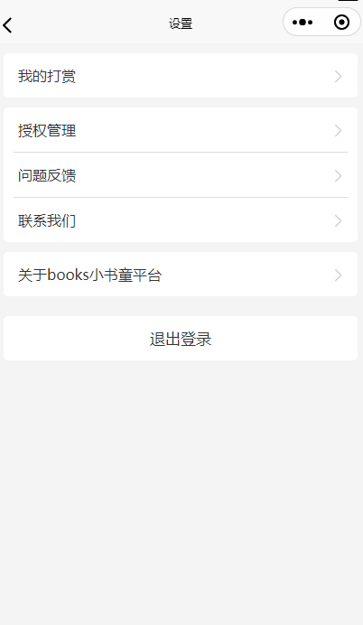

## 原型主页 


## 详情页


## 推荐页


## 个人登录


## 设置



## 登录页


## 投稿查看页


## 投递页面


## 接口设计

### 部分拦截器设计


### 接口设计规范

### 个人信息

#### 1.人员基本信息

##### 1.1 添加用户

参数格式：application/json

请求方式：POST

请求路径：/user/user/register

**Body**

| 名称     | 类型    | 是否必须 | 默认值 | 备注          | 其他信息 |
| -------- | ------- | -------- | ------ | ------------- | -------- |
| id       | integer | 非必须   |        | 员工 id       | int      |
| openid   | string  | 必须     |        | 外部登录 id   |          |
| name     | string  | 必须     |        | 姓名          |          |
| phone    | string  | 必须     |        | 手机号        |          |
| account  | string  | 必须     |        | 用户名/账户名 |          |
| password | string  | 必须     |        | 密码          |          |

**示例**

```json
{
  "account": "acount1",
  "create_time": "",
  "id": 0,
  "name": "老王",
  "openid": "",
  "password": "123456",
  "phone": "123",
  "profile_picture": ""
}
```

**返回数据**

| 名称 | 类型    | 是否必须 | 默认值              | 备注 | 其他信息      |
| ---- | ------- | -------- | ------------------- | ---- | ------------- |
| code | integer | 必须     | code=1 表示请求成功 |      | format: int32 |
| data | object  | 非必须   |                     |      |               |
| msg  | string  | 非必须   |                     |      |               |

##### 1.2 查询用户信息

参数格式：application/json

请求方式：GET

请求路径：/user/user/{id}

**路径参数**

| 参数名称 | 示例 | 备注    |
| -------- | ---- | ------- |
| id       | 10   | 员工 id |

**返回数据**

```json
{
  "code": 1,
  "data": {},
  "msg": "..."
}
```

##### 1.3 更新用户信息

参数格式：application/json

请求方式：PUT

请求路径：/user/user/

```json
{
  "account": "",
  "createTime": "",
  "id": 0,
  "name": "",
  "openid": "",
  "password": "",
  "phone": "",
  "profilePicture": ""
}
```

##### 1.4 修改密码

参数格式：application/json

请求方式：PUT

请求路径：/user/user/editPassword

```json
{
  "account": "",
  "id": 0,
  "openid": "",
  "password": "",
  "phone": ""
}
```

##### 1.5 用户登录

参数格式：application/json

请求方式：POST

请求路径：/user/user/login

```json
{
  "account": "",
  "createTime": "",
  "id": 0,
  "name": "",
  "openid": "",
  "password": "",
  "phone": "",
  "profilePicture": "",
  "token": ""
}
```

##### 1.6 退出登录

参数格式：application/json

请求方式：POST

请求路径：/user/user/logout

```json
无
```

#### 2.学校基本信息

##### 2.1 添加学校

参数格式：application/json

请求方式：POST

请求路径：/school/school

```json
{
  "id": 0,
  "schoolName": ""
}
```

##### 2.2 删除学校

参数格式：application/json

请求方式：DELETE

请求路径：/school/school

```json
{
  "id": 0,
  "schoolName": ""
}
```

##### 2.3 更新学校信息

参数格式：application/json

请求方式：PUT

请求路径：/school/school

```json
{
  "id": 0,
  "schoolName": ""
}
```

#### 3. 语文老师信息

##### 3.1 添加老师

参数格式：application/json

请求方式：POST

请求路径：/teacher/teacher/register

body:

```json
{
  "account": "老师1",
  "createTime": "",
  "id": 0,
  "name": "老王",
  "openid": "",
  "password": "123",
  "phone": "",
  "profilePicture": "",
  "token": ""
}
```

##### 3.2 删除老师

参数格式：application/json

请求方式：DELETE

请求路径：/teacher/teacher

```json
{
  "account": "老师1",
  "createTime": "",
  "id": 0,
  "name": "老王",
  "openid": "",
  "password": "123",
  "phone": "",
  "profilePicture": "",
  "token": ""
}
```

##### 3.3 更新老师信息

参数格式：application/json

请求方式：PUT

请求路径：/teacher/teacher

```json
{
  "account": "老师1",
  "createTime": "",
  "id": 0,
  "name": "老王",
  "openid": "",
  "password": "123",
  "phone": "",
  "profilePicture": "",
  "token": ""
}
```

##### 3.4 修改密码

参数格式：application/json

请求方式：PUT

请求路径：/teacher/teacher/editPassword

```json
{
  "account": "老师1",
  "createTime": "",
  "id": 0,
  "name": "老王",
  "openid": "",
  "password": "123",
  "phone": "",
  "profilePicture": ""
}
```

##### 3.5 老师登录

参数格式：application/json

请求方式：POST

请求路径：/teacher/teacher/login

```json
{
  "account": "老师1",
  "createTime": "",
  "id": 0,
  "name": "老王",
  "openid": "",
  "password": "123",
  "phone": "",
  "profilePicture": ""
}
```

##### 3.6 退出登录

参数格式：application/json

请求方式：POST

请求路径：/teacher/teacher/logout

### 稿件

#### 1. 阅读发布管理

##### 1.1 发布阅读任务

参数格式：application/json

请求方式：POST

请求路径：/teacher/read/spread

```json
{
  "contributes": [
    {
      "briefIntroduction": "",
      "createTime": "",
      "id": 0,
      "picture": "",
      "summary": "",
      "title": "",
      "updateTime": "",
      "url": "",
      "userId": 0
    }
  ],
  "createTime": "",
  "deadline": "",
  "id": 0,
  "taskDetail": "",
  "taskSuggestion": "",
  "taskTitle": "",
  "teacherId": 0
}
```

#### 2. 投稿管理

##### 2.1 用户投稿

参数格式：application/json

请求方式：POST

请求路径：/user/contribute

请求示例：

```json
{
  "briefIntroduction": "",
  "createTime": "",
  "id": 0,
  "picture": "",
  "summary": "",
  "title": "",
  "updateTime": "",
  "url": "",
  "userId": 0
}
```

##### 2.2 用户撤销稿件

参数格式：application/json

请求方式：POST

请求路径：/user/contribute/quit

```json
{
  "briefIntroduction": "",
  "createTime": "",
  "id": 0,
  "picture": "",
  "summary": "",
  "title": "",
  "updateTime": "",
  "url": "",
  "userId": 0
}
```

##### 2.3 用户查看稿件详情

参数格式：application/json

请求方式：POST

请求路径：/user/contribute/detail/{id}

##### 2.4 用户查看稿件

参数格式：application/json

请求方式：POST

请求路径：/user/contribute/page

请求体：

| 参数名称        | 是否必须 | 示例                               | 备注           |
| --------------- | -------- | ---------------------------------- | -------------- |
| review_result   | 否       | 审核通过，或审核未通过，以及待审核 | 审核状态       |
| review_info     | 否       | 审核处理阶段                       | 审核处理阶段   |
| recommend_level | 否       |                                    | 是否已经推荐过 |
| name            | 否       |                                    | 稿件名称       |
| page            | 是       |                                    | 页码           |
| pageSize        | 是       |                                    | 每页记录数     |

请求体示例

````json
{
  "title":"鲁迅", // 对标题的限制
  "page": 1, // 页码
  "pageSize": 10 // 页尺寸（固定为10）
}

##### 2.4 稿件上传

参数格式：application/json

请求方式：POST

请求路径：/user/common/upload

```json
{
  "briefIntroduction": "",
  "createTime": "",
  "id": 0,
  "picture": "",
  "summary": "",
  "title": "",
  "updateTime": "",
  "url": "",
  "userId": 0
}
````

##### 2.5 用户更新稿件

参数格式：application/json

请求方式：PUT

请求路径：/user/contribute

```json
{
  "briefIntroduction": "",
  "createTime": "",
  "id": 0,
  "picture": "",
  "summary": "",
  "title": "",
  "updateTime": "",
  "url": "",
  "userId": 0
}
```

#### 3. 稿件审核

##### 3.1 教师审核稿件

参数格式：application/json

请求方式：PUT

请求路径：/teacher/approve_contribute/approve

```json
{
  "contributeId": 0,
  "id": 0,
  "improvementSuggestion": "",
  "reviewInfo": 0,
  "reviewResult": 0,
  "reviewTime": "",
  "teacherId": 0
}
```

##### 3.2 教师修改审核信息

参数格式：application/json

请求方式：PUT

请求路径：/teacher/approve_contribute/modify

```json
{
  "contributeId": 0,
  "id": 0,
  "improvementSuggestion": "",
  "reviewInfo": 0,
  "reviewResult": 0,
  "reviewTime": "",
  "teacherId": 0
}
```

#### 4. 稿件推荐

##### 4.1 教师推荐稿件

参数格式：application/json

请求方式：POST

请求路径：/teacher/recommend

```json
{
  "contributeId": 0,
  "id": 0,
  "reason": "",
  "recommendLevel": 0,
  "teacherId": 0
}
```

##### 4.2 教师修改推荐信息

参数格式：application/json

请求方式：PUT

请求路径：/teacher/recommend

```json
{
  "contributeId": 0,
  "id": 0,
  "reason": "",
  "recommendLevel": 0,
  "teacherId": 0
}
```

#### 5. 稿件录用管理

##### 5.1 查看录用的稿件

参数格式：application/json

请求方式：GET

请求路径：/teacher/contribute/page

| 参数名称     | 是否必须 | 示例                               | 备注       |
| ------------ | -------- | ---------------------------------- | ---------- |
| reviewResult | 否       | 审核通过，或审核未通过，以及待审核 | 审核状态   |
| recommended  | 否       | 是否已经推荐过                     | 审核状态   |
| name         | 否       |                                    | 稿件名称   |
| page         | 是       |                                    | 页码       |
| pageSize     | 是       |                                    | 每页记录数 |

请求体示例

```json
{
  "title": "火", // 对标题的限制
  "page": 1, // 页码
  "pageSize": 10 // 页尺寸（固定为10）
}
```

#### 6. 征稿管理

##### 6.1 征稿管理发布

参数格式：application/json

请求方式：POST

请求路径：/teacher/solicitation/publish

```json
{
  "coverUrl": "",
  "id": 0,
  "introduction": "",
  "requirements": "",
  "solicitationContent": "",
  "teacherId": 0,
  "title": ""
}
```

##### 6.2 征稿信息更新

参数格式：application/json

请求方式：POST

请求路径：/teacher/solicitation/update

```json
{
  "coverUrl": "",
  "id": 0,
  "introduction": "",
  "requirements": "",
  "solicitationContent": "",
  "teacherId": 0,
  "title": ""
}
```

##### 6.3 征稿任务删除

参数格式：application/json

请求方式：POST

请求路径：/teacher/solicitation/delete

```json
{
  "coverUrl": "",
  "id": 0,
  "introduction": "",
  "requirements": "",
  "solicitationContent": "",
  "teacherId": 0,
  "title": ""
}
```

##### 6.5 征稿任务查询

参数格式：application/json

请求方式：GET

请求路径：/teacher/solicitation?id = 1

##### 6.6 征稿任务分页查询

参数格式：application/json

请求方式：POST

请求路径：/teacher/solicitation/page

```json
{
  "page": 0,
  "pageSize": 0,
  "title": ""
}
```

#### 7. 稿件查看

##### 7.1 稿件查看

参数格式：application/json

请求方式：POST

请求路径 1：/teacher/contribute/page

请求路径 2：/user/contribute/page

| 参数名称 | 是否必须 | 示例                               | 备注       |
| -------- | -------- | ---------------------------------- | ---------- |
| state    | 否       | 审核通过，或审核未通过，以及待审核 | 审核状态   |
| name     | 否       |                                    | 稿件名称   |
| page     | 是       |                                    | 页码       |
| pageSize | 是       |                                    | 每页记录数 |

#### 8 阅读任务

##### 8.1 阅读任务发布

参数格式：application/json

请求方式：POST

请求路径：/teacher/read_tasks/publish

```json
{
  "contributes": [
    {
      "briefIntroduction": "",
      "createTime": "",
      "id": 0,
      "picture": "",
      "summary": "",
      "title": "",
      "updateTime": "",
      "url": "",
      "userId": 0
    }
  ],
  "createTime": "",
  "deadline": "",
  "id": 0,
  "taskDetail": "",
  "taskSuggestion": "",
  "taskTitle": "",
  "teacherId": 0
}
```

##### 8.2 阅读任务的修改

参数格式：application/json

请求方式：POST

请求路径：/teacher/read_tasks/update

```json
{
  "contributes": [
    {
      "briefIntroduction": "",
      "createTime": "",
      "id": 0,
      "picture": "",
      "summary": "",
      "title": "",
      "updateTime": "",
      "url": "",
      "userId": 0
    }
  ],
  "createTime": "",
  "deadline": "",
  "id": 0,
  "taskDetail": "",
  "taskSuggestion": "",
  "taskTitle": "",
  "teacherId": 0
}
```

##### 8.3 阅读任务的删除

参数格式：application/json

请求方式：POST

请求路径：/teacher/read_tasks/delete

```json
{
  "contributes": [
    {
      "briefIntroduction": "",
      "createTime": "",
      "id": 0,
      "picture": "",
      "summary": "",
      "title": "",
      "updateTime": "",
      "url": "",
      "userId": 0
    }
  ],
  "createTime": "",
  "deadline": "",
  "id": 0,
  "taskDetail": "",
  "taskSuggestion": "",
  "taskTitle": "",
  "teacherId": 0
}
```

##### 8.4 阅读任务分页查询方法

参数格式：application/json

请求方式：POST

请求路径：/teacher/read_tasks/page

```json
{
  "page": 0,
  "pageSize": 0,
  "taskTitle": ""
}
```

#### 9 用户参与征稿

##### 9.1 用户投递

参数格式：application/json

请求方式：POST

请求路径：/user/solicitation_contribute

```json
{
  "contributeId": 0,
  "solicitationId": 0
}
```

##### 9.2 用户更新投稿

参数格式：application/json

请求方式：PUT

请求路径：/user/solicitation_contribute

```json
{
  "contributeId": 0,
  "solicitationId": 0
}
```

##### 9.3 用户取消投稿

参数格式：application/json

请求方式：DELETE

请求路径：/user/solicitation_contribute

```json
{
  "contributeId": 0,
  "solicitationId": 0
}
```


## OSS层存储桶


## 原型主页 


## 详情页


## 推荐页


## 个人登录


## 设置


## 登录页


## 投稿查看页


## 投递页面

